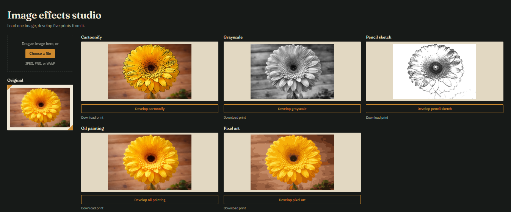

# Image Effects Studio

An OpenCV-powered web app. Upload an image, apply one of five effects on demand
(cartoonify, grayscale, pencil sketch, oil painting, pixel art), preview and
download each result independently.

**Live demo:** https://moshood-abdulganiyu-image-effects-studio-frontend.static.hf.space
**API docs:** https://image-effects-studio.onrender.com/docs



## Problem statement

Style-transfer filters are usually either a single hardcoded effect bolted onto
an upload form, or a heavyweight generative model that needs a GPU to run in
reasonable time. This project asks a narrower question: how far can classical
OpenCV image processing (color filtering, edge detection, quantization) go
toward five distinct, recognizable visual styles, served from a free-tier
CPU-only backend, with a UI that lets a user compare all five side by side on
their own image.

## Approach

The build followed 10 steps, each pushed to GitHub as its own commit.

1. **Scaffold the repo.** Folder structure (`src/`, `server/`, `client/`,
   `notebooks/`, `data/`, `screenshots/`), `pyproject.toml` managed with `uv`,
   `.gitignore` covering `data/`, `__pycache__`, `.venv`, and test image
   uploads. Getting the structure locked first meant every later step was
   about the code, not about where things go.

2. **Build and tune each effect in a notebook.** Each effect was implemented
   and visually tuned in `notebooks/effects_dev.ipynb` against four test
   images (two synthetic, one real headshot) before anything was locked into
   `src/effects.py`. Per-effect notes:

   - **Grayscale** — plain `cv2.cvtColor` conversion looked flat and lost
     detail in darker regions (dark skin/clothing against a bright
     background). Switched to CLAHE (`clip_limit=2.0`, `tile=8`), which
     applies local contrast enhancement in 8x8 tiles instead of one global
     histogram stretch, recovering detail that a single global adjustment
     would have crushed or blown out.
   - **Pencil sketch** — built on `cv2.pencilSketch`, tuned to
     `sigma_s=40, sigma_r=0.15, shade_factor=0.02`. A `pre_blur=3` (light
     Gaussian blur) was added before the sketch step specifically because the
     real headshot had visible sensor noise that showed up as speckle in the
     sketch lines; the synthetic images didn't need it.
   - **Cartoonify** — repeated bilateral filtering (`d=9, sigma_color=75,
     sigma_space=75`, 2 iterations) for the flat color layer, combined with a
     black edge mask from `adaptiveThreshold` (`block_size=9, C=4`) on a
     median-blurred (`median_blur=9`) grayscale image. The median blur bump
     from 7 to 9 was the fix for noise-driven black flecks appearing in the
     edge mask on the real photo, while still keeping sharp mortar lines on
     the brick-background test image.
   - **Oil painting** — `cv2.xphoto.oilPainting` (`size=7, dyn_ratio=1`).
     Larger brush sizes (10+) were tried first and rejected: they wiped out
     shirt embroidery and background mortar lines entirely, which read as
     lossy rather than painterly.
   - **Pixel art** — downscale/upscale with block size 8, followed by k-means
     color quantization to 16 colors. Without the quantization step, the
     result was indistinguishable from a plain blurry downscale; the flat
     16-color palette is what actually reads as "pixel art" rather than
     "small image."

3. **Extract into `src/effects.py`.** Five pure functions, each taking and
   returning a `numpy.ndarray` (BGR), no I/O and no framework code, so the
   notebook and the API call the same logic with nothing duplicated.

4. **Build the FastAPI backend.** A single `POST /predict` endpoint takes a
   multipart image upload plus an `effect` form field (enum of the five
   names) rather than five separate endpoints. Typed Pydantic
   request/response models, auto docs at `/docs`, and validation for content
   type, file size, and decode failures (all return 400, not 500).

5. **Test the backend locally.** Hit `/predict` through `/docs` and `curl` for
   all five effects against the four test images, plus error cases: wrong
   content type, oversized file, corrupt image data.

6. **Build the frontend structure.** Plain HTML/CSS/JS. Left panel is the
   upload zone and original image preview. Right side is a 3-top/2-bottom
   grid of five boxes, each with its own preview ``, button, and hidden
   download link. All five buttons stay disabled until an image is uploaded.

7. **Wire up the interactions.** Each box is independent: clicking one shows a
   loading state in that box only, sends one `POST /predict` for that effect,
   fills that box on success, and reveals its download link. Re-clicking a
   button overwrites only that box's result. This keeps one slow effect (oil
   painting) from blocking the other four.

8. **Style the frontend.** A full CSS pass around a "light-table for
   developing prints" concept: dark warm-black background, paper-toned result
   cards, a single amber safelight accent color, a subtle fade-in animation
   on new results, and clear disabled/enabled/loading button states.

9. **Connect and deploy.** Backend deployed to Render (Docker), frontend
   deployed to a Hugging Face Static Space, `API_BASE_URL` kept
   environment-aware so local development still points at `localhost`. See
   Architecture below for why the two are split.

10. **Write the README and polish** (this document). Pinned dependency
    versions, checked `.gitignore`, did a full read-through of the repo.

## Architecture

The backend (FastAPI, OpenCV) is deployed to **Render** as a Docker web
service. The frontend (static HTML/CSS/JS) is deployed to a **Hugging Face
Static Space**. These are split across two hosts because Hugging Face's free
Spaces tier does not give Docker-level access, which the OpenCV backend
needs (`opencv-contrib-python` and its system dependencies don't fit into a
plain static or Gradio Space). Render handles the compute; the HF Static
Space just serves static files for free. The frontend calls the Render API
over HTTPS, with CORS configured on the backend to explicitly allow the HF
Space origin.

## Known trade-offs

- **Cold starts.** Render's free tier spins the backend down after a period
  of inactivity. The first request after idle can take 30-50 seconds while
  the instance wakes up; subsequent requests are fast.
- **Oil painting is the slowest effect** of the five, since
  `cv2.xphoto.oilPainting` is more computationally expensive than the other
  four's filter operations.
- **`opencv-contrib-python` is required, not just `opencv-python`.** Oil
  painting depends on `cv2.xphoto`, which only ships in the contrib package.
  This is called out explicitly in `pyproject.toml` and below in Tech Stack,
  since it's an easy dependency to get wrong.
- **Large images aren't resized client-side before upload.** A very large
  upload will still work but takes longer to process and upload than
  necessary; client-side downscaling before the request would be a
  reasonable next improvement.
- **Cartoonify is a classical filter effect, not generative AI stylization.**
  It flattens colors (bilateral filtering) and darkens detected edges
  (adaptive thresholding) rather than semantically redrawing the image the
  way a diffusion or GAN-based model would. It won't reshape features or
  simplify patterns into clean vector shapes the way an AI illustrator
  would; that's a deliberate scope decision to keep the backend CPU-only and
  dependency-light, not an oversight.

## Local run instructions

Backend:
```
uv sync
uv run uvicorn server.main:app --reload
```
API available at `http://localhost:8000`, interactive docs at
`http://localhost:8000/docs`.

Frontend:
```
cd client
python -m http.server 8080
```
Open `http://localhost:8080`. `client/config.js` points `API_BASE_URL` at
`localhost:8000` automatically when not running on the deployed HF Space
origin.

## Tech stack

- **Backend:** Python, FastAPI, Pydantic, OpenCV (`opencv-contrib-python`,
  required over plain `opencv-python` for `cv2.xphoto.oilPainting`), NumPy
- **Frontend:** HTML, CSS, vanilla JavaScript (no framework)
- **Dependency management:** `uv`
- **Deployment:** Render (Docker, backend), Hugging Face Static Space
  (frontend)

## Repository

- Main repo (backend + frontend source): https://github.com/moshood-abdulganiyu/image-effects-studio
- Frontend deploy target: `moshood-abdulganiyu/image-effects-studio-frontend` on Hugging Face
